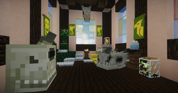
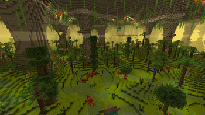
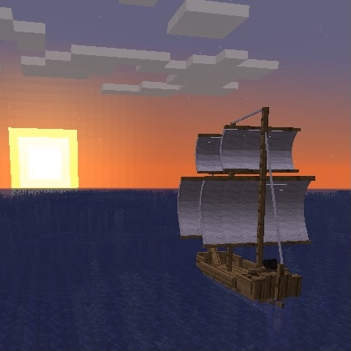

---
hide:
  - navigation
  - toc
---

  
Forge 1.20.1 · cooperative modpack

  <h1 class="sb-hero__title">Realm Gates</h1>
  
Something is devouring the worlds. We slip from realm to realm through the gates — always one step ahead of the <strong>Corruption</strong>, surviving together.

  

    <a class="md-button md-button--primary" href="getting-started/install/">Get started</a>
    <a class="md-button" href="mods/">Explore the dimensions</a>
  

Start here

  <a class="sb-card" href="getting-started/install/">
    ⬇️
    <h3>Install</h3>
    Get the modpack into your launcher in a few minutes.
  </a>
  <a class="sb-card" href="getting-started/voice-and-chat/">
    🎙️
    <h3>Voice &amp; translation</h3>
    Set your language and mic for the QSMP-style translator.
  </a>
  <a class="sb-card" href="concepts/">
    📖
    <h3>Concepts</h3>
    Plain-language answers to "wait, what is this?"
  </a>
  <a class="sb-card" href="mods/">
    🧩
    <h3>Dimensions</h3>
    The realms you travel between — and every mod inside them.
  </a>

Made for this server

<h2 class="sb-section-title">Custom features you won't find elsewhere</h2>

  <a class="sb-card" href="custom/voice-translate/">
    🗣️
    <h3>Voice Translate</h3>
    Floating subtitles above a speaker's head, translated into <em>your</em> language. Text chat too. No API key needed.
  </a>
  <a class="sb-card" href="custom/realmgates/">
    🌀
    <h3>Realm Gates</h3>
    A custom system that controls travel between dimensions and unlocks them as you progress.
  </a>
  <a class="sb-card" href="custom/custom-companions/">
    🐾
    <h3>Custom Companions</h3>
    Build a personal companion that fights with you, levels up, and grows into your own build.
  </a>

A taste of what's inside

<h2 class="sb-section-title">Big worlds, bigger fights</h2>

  <a class="mod-card" href="https://modrinth.com/mod/ice-and-fire-dragons" target="_blank" rel="noopener">
    Dimension 1
    Ice &amp; FireTame dragons and fight mythical beasts for the strongest gear in the pack.Mod page ↗
  </a>
  <a class="mod-card" href="https://modrinth.com/mod/alexs-caves" target="_blank" rel="noopener">
    Dimension 1
    Alex's CavesSix exotic underground worlds, each its own ecosystem.Mod page ↗
  </a>
  <a class="mod-card" href="https://modrinth.com/mod/oh-the-biomes-weve-gone" target="_blank" rel="noopener">
    Dimension 1
    50+ new biomesA world full of new forests, wood, crops and scenery.Mod page ↗
  </a>
  <a class="mod-card" href="https://modrinth.com/mod/smallships" target="_blank" rel="noopener">
    Dimension 1
    Small ShipsSail real navigable boats and ships across the sea.Mod page ↗
  </a>

<a class="md-button" href="mods/">Explore the dimensions</a>

You'll need <strong>Minecraft: Java Edition</strong> with a <strong>Forge 1.20.1</strong> instance, and the server address — ask the admin. Mod artwork © their respective authors, via Modrinth.

