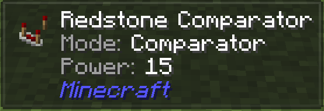
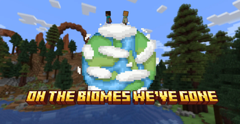

---
hide:
  - toc
---

  

    
The pack

    <h1>Dimensions</h1>
  

Realm Gates is built around **dimensions** — separate realms you travel between as you progress.
You start in **Aincrad** (Dimension 1), and more realms open up over time (the
**[Realm Gates](../custom/realmgates.md)** mod controls when each one unlocks).

Each mod is tagged by where it lives: a specific **Dimension**, or **All dimensions** for the
universal mods (UI, performance, combat, social) that follow you everywhere.

  <a class="mod-card" href="all-dimensions/">
    All dimensions
    All dimensionsThe universal mods — UI, performance, combat, travel, magic — that follow you into every realm.Open ↗
  </a>
  <a class="mod-card" href="dimension-1/">
    Aincrad
    Dimension 1 — AincradYour home realm: a familiar overworld where all of the pack's current content lives.Open ↗
  </a>
  
    🔒
    Coming soonDimension 2A new realm is on the way — its own world, creatures and rules.
  
  
    🔒
    Coming soonDimension 3Another realm planned further down the road. Unlocked through Realm Gates.
  

Made for this server

  <a class="sb-card" href="../custom/realmgates/">🌀<h3>Realm Gates</h3>The system that controls dimension travel and unlocks new realms.</a>
  <a class="sb-card" href="../custom/custom-companions/">🐾<h3>Custom Companions</h3>Buildable companions that fight with you.</a>
  <a class="sb-card" href="../custom/voice-translate/">🗣️<h3>Voice Translate</h3>Real-time voice &amp; chat translation.</a>

!!! info "What about the libraries?"
    The pack also includes ~20 background **libraries / APIs** (Architectury, GeckoLib, KubeJS,
    Citadel, TerraBlender…). They're dependencies other mods need — nothing to use or learn — so
    they don't get individual pages here.
